# Instructions

### 1. Hardware Assembly (scroll down for code setup)

First, follow the wiring diagram to connect wires to the proper pins on the ESP32:

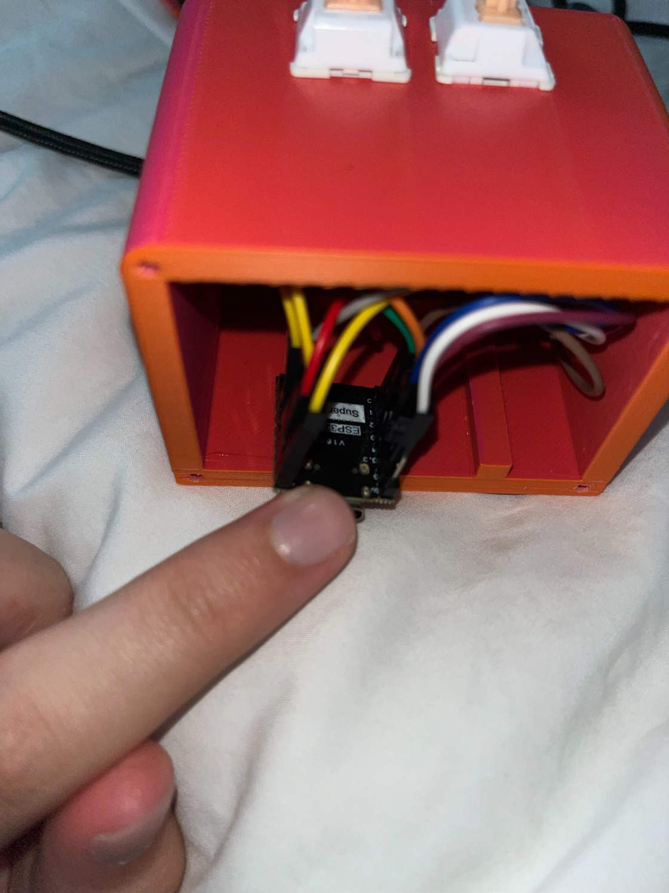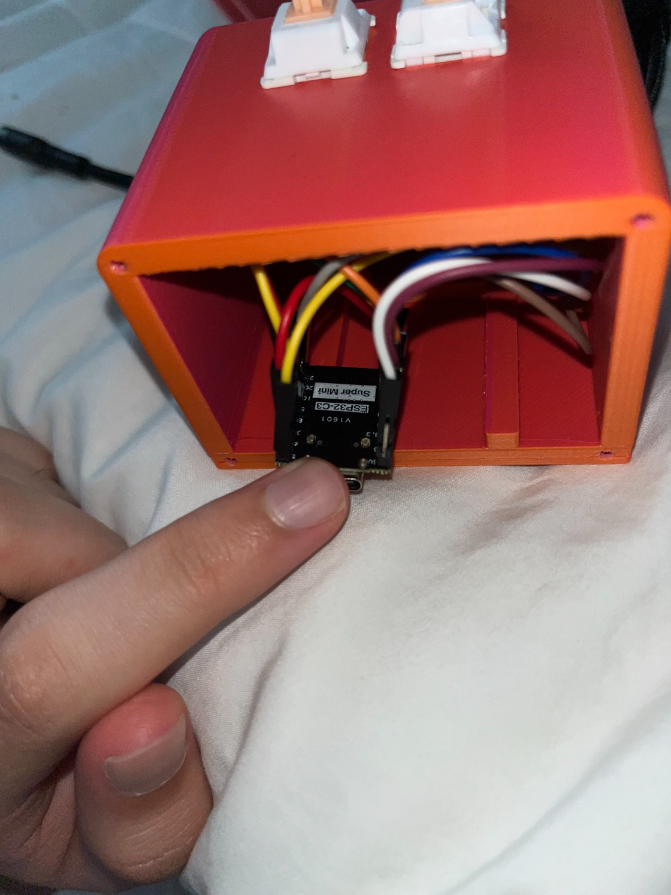

Next, link 4 of the wires to the keycaps (wires are specified in wiring diagram). To connect the dupont wires to a keycap, you have to cut off the head of the wire and strip it down so that it can be wrapped around the keycap pin. Then snap your keycaps in place!

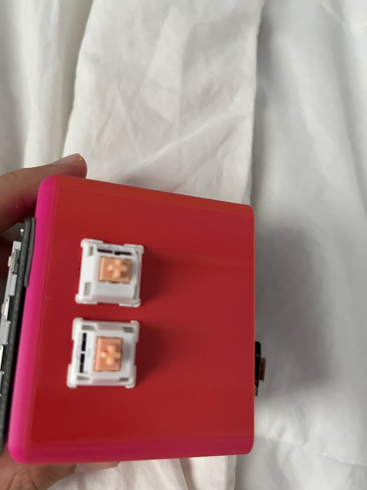

Then, link the wires to the display (follow the diagram)!

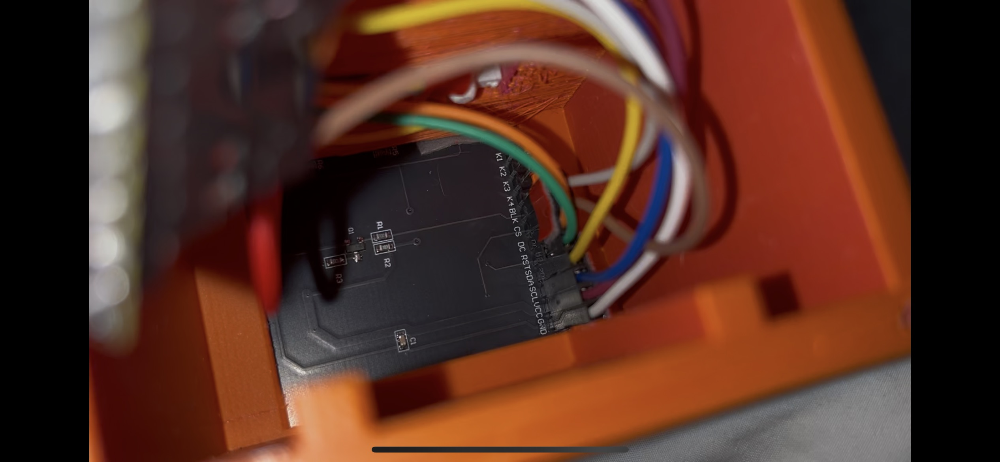

Finally, screw in the back cover and you're done with the build!

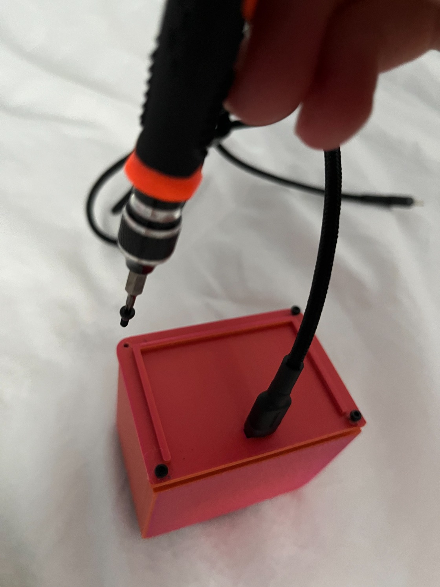

### 2. Software code setup

1. Install the Arduino IDE app [https://www.arduino.cc/en/software/](https://www.arduino.cc/en/software/)
2. Once software is installed, copy and paste the code from the [Weather display sketch](./weather_display_sketch.ino)
3. Replace this with your actual Wifi information  
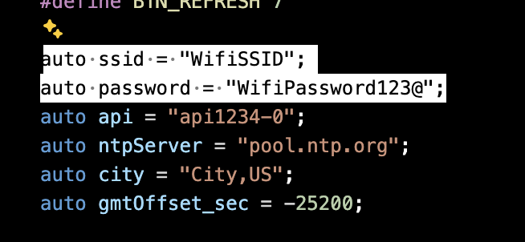
4. Then add in your city  
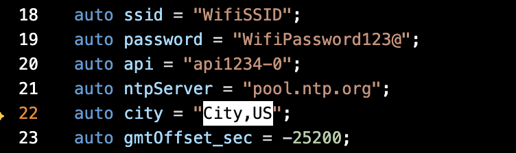
5. Adjust this value to your time zone (calculate from the web)  
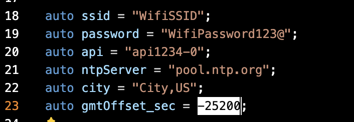
6. Install the libraries (files are in the libraries folder) by selecting Sketch > Include library > Add .Zip Library  
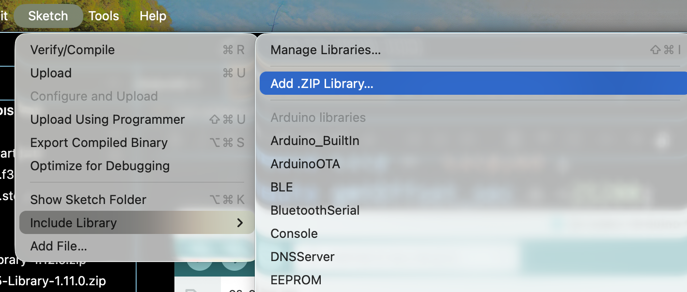
7. Confirm they are uploaded by going to library manager tab (books icon) and select installed libraries in the type section  
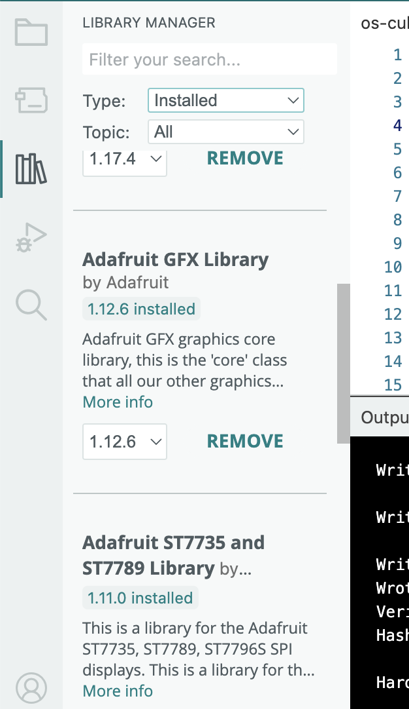
8. Connect your ESP32 by USB-C and make sure it is selected in the top bar of the app  
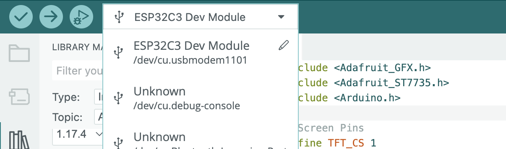
9. Click this icon to upload the code  
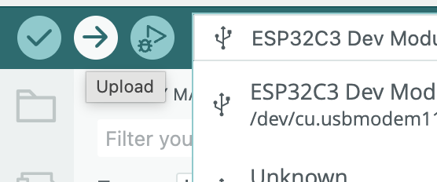
10. Finished! Enjoy your weather display!
